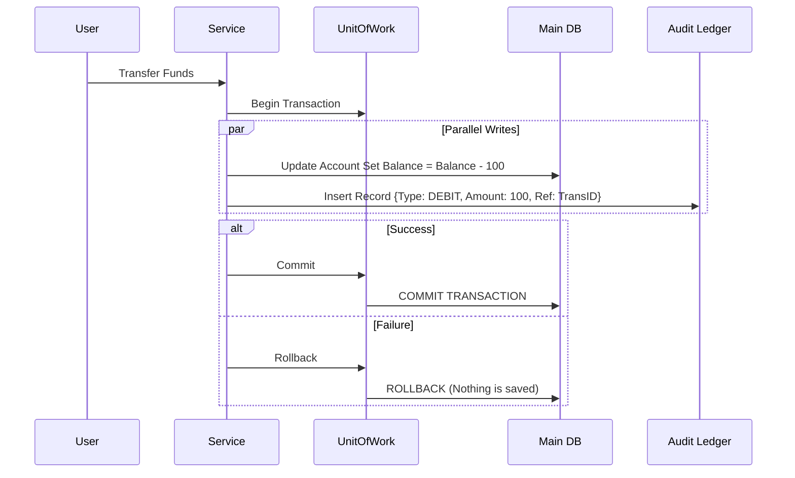

# ADR-016: Integridad de Datos Financieros y Auditoría Inmutable

## Estado
Aceptado

## Contexto
En sistemas financieros o contables, confiar únicamente en el estado actual de una entidad (ej. `balance = 100`) es insuficiente y peligroso.
Errores de concurrencia, fallos de red o bugs lógicos pueden alterar el saldo sin dejar rastro, haciendo imposible la conciliación y destruyendo la confianza del usuario.
La pérdida de datos o la inconsistencia (ej. dinero descontado pero no transferido) tiene implicaciones legales graves.

## Decisión
Implementar un **Ledger de Auditoría Inmutable (Append-Only)** en paralelo a las tablas de estado, gestionado atómicamente mediante el patrón **Unit of Work**.

## Diseño Detallado

### Doble Escritura Atómica
Toda operación que modifique el estado financiero debe insertar simultáneamente un registro en una tabla de auditoría (Ledger).

### Características del Ledger
*   **Solo Escritura (Append-Only):** No se permiten `UPDATE` ni `DELETE`.
*   **Inmutabilidad:** Garantizada por permisos de base de datos o tecnología WORM (Write Once Read Many) si es necesario por regulación.
*   **Reconciliación:** El saldo actual debe ser siempre recalculable sumando todo el historial del Ledger.

## Consecuencias

### Positivas
*   **Trazabilidad Total:** Cada centavo tiene un historial explicable.
*   **Recuperación de Desastres:** Si la tabla de saldos se corrompe, se puede reconstruir desde el Ledger.
*   **Cumplimiento Normativo:** Satisface requisitos de auditoría financiera.

### Negativas
*   **Volumen de Datos:** La tabla de Ledger crece indefinidamente. Requiere estrategias de particionamiento o archivado (Cold Storage) a largo plazo.
*   **Rendimiento:** Doble escritura implica un ligero overhead en cada transacción.

## Cumplimiento
*   Prohibido modificar saldos sin crear la entrada correspondiente en el Ledger.
*   Las pruebas unitarias deben verificar que el Ledger cuadre con el saldo final.
