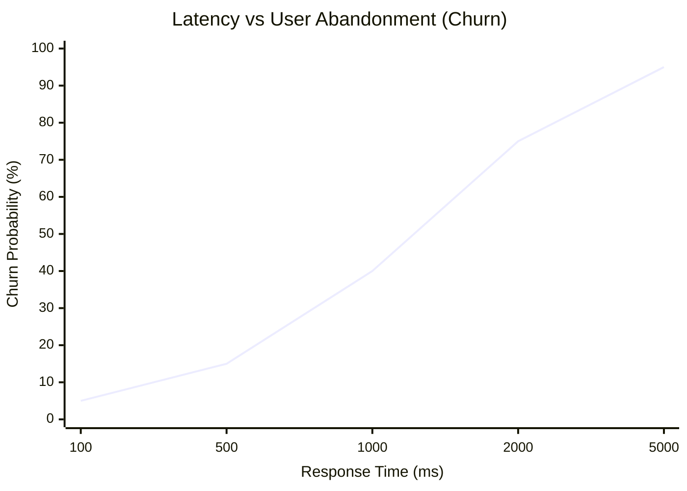

# ADR-017: Latencia como KPI de Producto y Retención de Usuarios (Redis)

## Estado
Aceptado

## Contexto
En plataformas de e-commerce y Punto de Venta (POS) como `finzapp_api`, la velocidad de respuesta es directamente proporcional a la tasa de conversión y retención.
Estudios demuestran que una latencia superior a 500ms en el checkout puede reducir las ventas significativamente.
La base de datos relacional (PostgreSQL) se convierte en un cuello de botella bajo alta concurrencia, degradando la experiencia de usuario (UX).

## Decisión
Priorizar la **Baja Latencia (<100ms)** como un requisito funcional crítico, implementando **Caching Agresivo con Redis** en las rutas críticas (Catálogo, Perfil, Checkout).

## Diseño Detallado

### Estrategia de Optimización
No se trata solo de "cachear todo", sino de optimizar los flujos de usuario que generan ingresos.

```mermaid
gantt
    title Latency Comparison: Database vs Redis
    dateFormat X
    axisFormat %s

    section Product Details
    Direct DB Query   : 0, 120ms
    Redis Hit         : 0, 5ms

    section User Profile
    Direct DB Query   : 0, 85ms
    Redis Hit         : 0, 3ms
```

### Métricas de Negocio
Se monitorizará la correlación entre Latencia y Abandono (Churn).

## Consecuencias

### Positivas
*   **Conversión:** Aumento directo en ventas y satisfacción del cliente.
*   **Escalabilidad:** Redis maneja miles de RPS con mínima CPU, protegiendo la DB principal.
*   **Resiliencia:** El sistema puede seguir sirviendo lecturas (de caché) incluso si la DB está bajo carga extrema.

### Negativas
*   **Complejidad de Invalidación:** Mantener el caché sincronizado requiere una estrategia robusta (ver ADR-007).
*   **Costos de Memoria:** Almacenar todo el catálogo en RAM puede ser costoso si no se gestiona bien la expiración (LRU).

## Cumplimiento
*   Cualquier endpoint crítico que tarde más de 200ms en el 95% de los casos (p95) debe ser optimizado o cacheado obligatoriamente.
*   Se deben incluir métricas de latencia en los dashboards de negocio.
