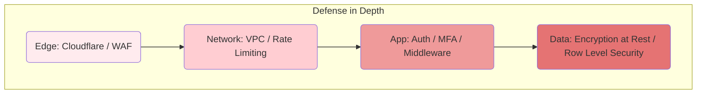
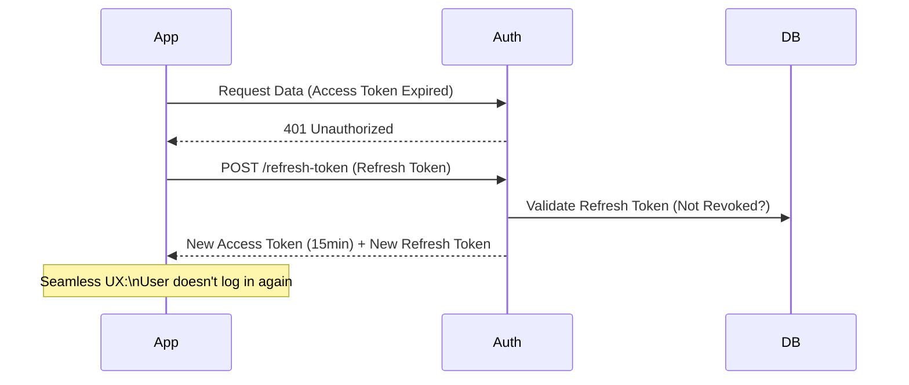

# ADR-018: Seguridad en Capas (Defense in Depth) para Confianza del Cliente

## Estado
Aceptado

## Contexto
En el mercado B2B Enterprise y Fintech, la seguridad no es un "feature" opcional, sino un requisito contractual y de cumplimiento (SOC2, GDPR, PCI-DSS).
Confiar en una sola capa de defensa (e.g., solo autenticación) es insuficiente.
Los clientes corporativos exigen garantías de que sus datos están cifrados, aislados y protegidos contra ataques avanzados.

## Decisión
Implementar una estrategia de **Defensa en Profundidad (Defense in Depth)**, aplicando múltiples controles de seguridad en cada capa del stack tecnológico.

## Diseño Detallado

### Capas de Seguridad

### Gestión de Sesiones (Refresh Tokens)
Para minimizar el riesgo de robo de credenciales, los Access Tokens tienen vida corta (15 min) y se rotan mediante Refresh Tokens seguros (HttpOnly Cookie).

## Consecuencias

### Positivas
*   **Ventas B2B:** Habilita cerrar contratos con grandes empresas que auditan la seguridad.
*   **Confianza:** Los usuarios finales confían sus datos financieros a la plataforma.
*   **Resiliencia:** Si una capa falla (e.g. WAF bypass), hay otras capas protegiendo el núcleo (e.g. RLS en DB).

### Negativas
*   **Fricción de Desarrollo:** Requiere configurar y mantener múltiples herramientas (WAF, Vault, IAM).
*   **Complejidad de UX:** El uso de MFA y sesiones cortas puede incomodar a usuarios no técnicos si no se diseña bien.

## Cumplimiento
*   Todos los secretos (API Keys, DB Passwords) deben gestionarse en un Secret Manager, nunca en código.
*   Los datos sensibles (PII) deben estar cifrados en reposo (AES-256) y en tránsito (TLS 1.3).
