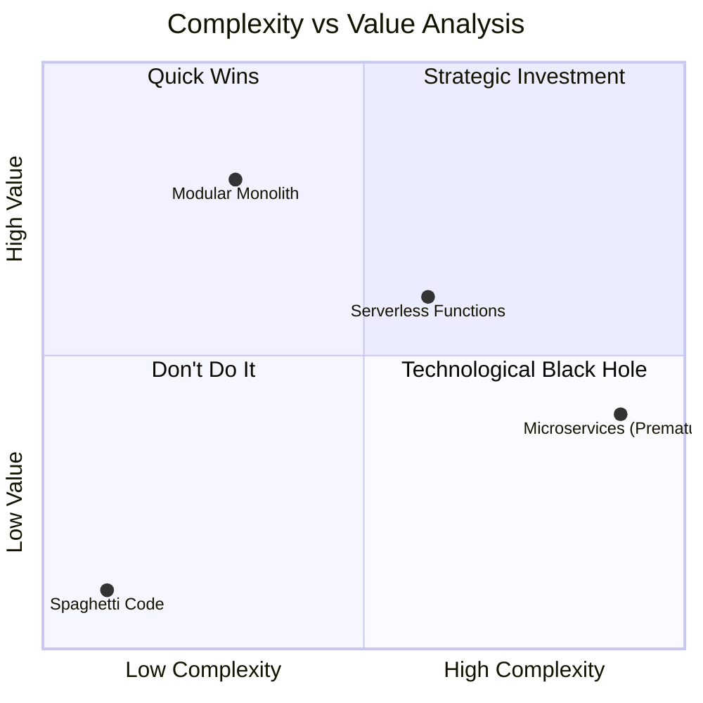
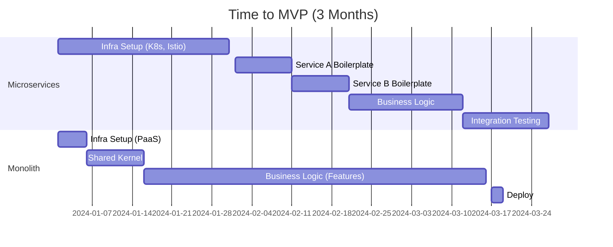

# ADR-019: Arquitectura Pragmática basada en Retorno de Inversión (ROI)

## Estado
Aceptado

## Contexto
En el ecosistema tecnológico actual, existe una fuerte presión por adoptar arquitecturas complejas (Microservicios, Kubernetes, Serverless) prematuramente.
Sin embargo, para una startup o un producto en crecimiento, el recurso más escaso es el tiempo de ingeniería.
Invertir meses en infraestructura distribuida antes de validar el modelo de negocio es un riesgo financiero alto (Costo de Oportunidad).

## Decisión
Priorizar un enfoque de **Monolito Modular (Vertical Slice)** sobre Microservicios Distribuidos para la etapa actual del negocio.

La decisión se basa en maximizar el ROI: obtener la mayor funcionalidad de negocio con la menor complejidad accidental posible.

## Análisis de Costo-Beneficio

### Tiempo al Mercado (Time to MVP)

## Consecuencias

### Positivas
*   **Velocidad:** El equipo se enfoca en resolver problemas de usuario, no en configurar redes mesh.
*   **Costos Operativos:** Una sola instancia (o cluster pequeño) es más barata que orquestar docenas de contenedores.
*   **Simplicidad:** Debugging y testing son triviales en un solo proceso.

### Negativas
*   **Escalado de Equipo:** A partir de cierto tamaño (e.g. 50 ingenieros), el monolito puede causar conflictos de merge (se mitiga con módulos estrictos).
*   **Tecnología Homogénea:** Todo el sistema debe usar el mismo lenguaje/framework principal.

## Cumplimiento
*   Cualquier propuesta de introducir un nuevo servicio independiente debe venir acompañada de un análisis de ROI justificando por qué no puede vivir dentro del monolito modular.
