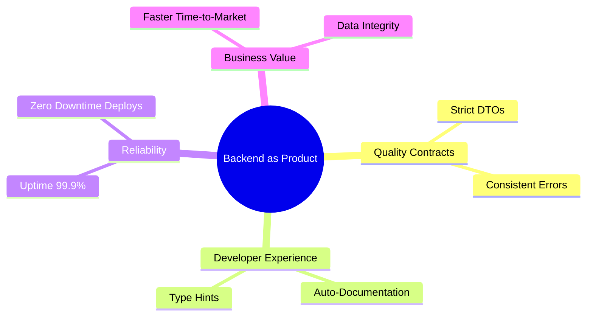
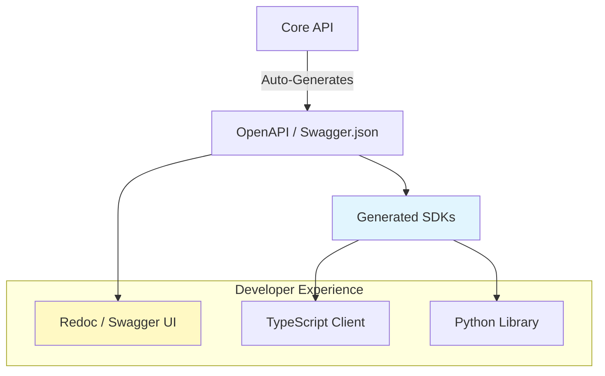

# ADR-020: El Backend como Producto Interno

## Estado
Aceptado

## Contexto
En organizaciones modernas, la API es consumida por múltiples "clientes" (App Móvil, Web SPA, Partners, Equipos de Data).
Tratar el backend como un simple "script que devuelve datos" genera fricción: documentación desactualizada, errores crípticos ("Internal Server Error") y contratos (JSON) que cambian sin aviso, rompiendo los clientes.
Esto convierte al equipo de Backend en un cuello de botella para la organización.

## Decisión
Adoptar la filosofía de **"Backend as a Product"**. La API interna se trata con el mismo rigor que un producto público (como Stripe o Twilio).

## Diseño Detallado

### Ecosistema de Consumo

### Generación Automática de SDKs
La documentación (OpenAPI/Swagger) es la fuente de verdad. No se escriben clientes HTTP a mano.

## Consecuencias

### Positivas
*   **Autonomía del Frontend:** Los equipos de frontend pueden trabajar más rápido usando SDKs tipados y documentación clara.
*   **Reducción de Errores:** Los contratos estrictos evitan `undefined is not a function` en el cliente.
*   **Onboarding:** Nuevos desarrolladores entienden el sistema leyendo la documentación interactiva.

### Negativas
*   **Rigor:** Requiere disciplina para mantener los esquemas DTO actualizados y bien descritos.
*   **Tooling:** Necesidad de configurar pipelines para generar y publicar los SDKs/Docs.

## Cumplimiento
*   Todos los endpoints deben tener descripciones, ejemplos de respuesta y códigos de error documentados en el código (anotaciones).
*   No se acepta un PR si la especificación OpenAPI generada es inválida.
